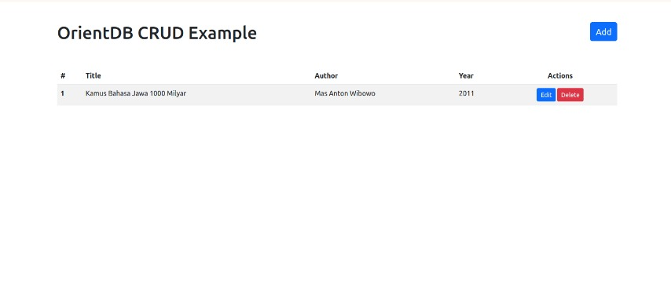
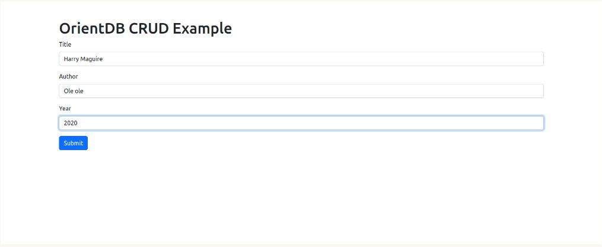

# Dokumentasi Project (cara install/cara setup/endpoin/screenshot)

**UAS MANAJEMEN BASIS DATA**

Anggota Kelompok 4 :
- Indri Nurfiani (1207050050)
- M Syahrul Anwar Aria (1207050058)
- M Syarif Syarifuddin (1207050059)

## Cara Instalasi OrientDB via Docker
Run command berikut pada terminal :
```
docker run -d --name orientdb -p 2424:2424 -p 2480:2480 -e ORIENTDB_ROOT_PASSWORD=root orientdb:latest
```

Run OrientDB console :
```
docker exec -it orientdb /bin/sh
# console.sh
```

Run OrientDB studio :

Buka http://localhost:2480 pada browser

Connect to server instances :
```
http://localhost:2480 pada browser
```

## Penjelasan Aplikasi

Membuat aplikasi web untuk melakukan CRUD pada tabel books di OrientDB dimana terdapat 4 field yaitu id, title, author, dan year.

**Connect OrientDB to Node.js App**

Install required dependecies :
```
npm install express ejs orientjs
```

**Initializing Server API**
```
// app.js

const OrientDB = require('orientjs');

const server = OrientDB({
    host: 'localhost',
    port: 2424,
    username: 'root',
    password: 'rootpwd',
    useToken: true
});

const db = server.use({
    name: 'cobain',
    username: 'admin',
    password: 'admin'
});
```

**Create Class and Properties**
```
// app.js

db.exec('CREATE CLASS Book IF NOT EXISTS EXTENDS V');

db.exec('CREATE PROPERTY Book.id IF NOT EXISTS INTEGER');
db.exec('CREATE PROPERTY Book.title IF NOT EXISTS STRING');
db.exec('CREATE PROPERTY Book.author IF NOT EXISTS STRING');
db.exec('CREATE PROPERTY Book.year IF NOT EXISTS STRING');
```

**Create Route**

Show all records
```
// app.js
// Show all records
app.get('/',async (req, res) => {
    const sql = 'SELECT FROM Book';
    const result = await db.query(sql);
    res.render('index', { books: result });
});
```

Show add book form page
```
app.get('/add', (req, res) => {
    res.render('add-book');
});
```

Save data to database
```
app.post('/add', async (req, res) => {
    const { title, author, year } = req.body;
    const sql = 'INSERT INTO Book (id, title, author, year) VALUES (:id, :title, :author, :year)';
    const idquery = 'SELECT MAX(id) FROM Book';
    const id = await db.query(idquery).then((result) => {
        if (result[0]['MAX'] == null) {
            return 1;
        }
        return result[0]['MAX'] + 1;
    });
    const result = await db.query(sql, { params: { id, title, author, year } });
    res.redirect('/');
});
```

Show edit form page
```
app.get('/edit/:id', async (req, res) => {
    const { id } = req.params;
    const sql = 'SELECT FROM Book WHERE id = :id';
    const result = await db.query(sql, { params: { id } });
    res.render('edit-book', { book: result[0] });
});
```

Save updated record to database
```
app.post('/edit/:id', async (req, res) => {
    const { id } = req.params;
    const { title, author, year } = req.body;
    const sql = 'UPDATE Book SET title = :title, author = :author, year = :year WHERE id = :id';
    const result = await db.query(sql, { params: { id, title, author, year } });
    res.redirect('/');
});
```

Delete record
```
app.get('/delete/:id', async (req, res) => {
    const { id } = req.params;
    const sql = 'DELETE VERTEX FROM Book WHERE id = :id';
    const result = await db.query(sql, { params: { id } });
    res.redirect('/');
});
```

**Screenshot**




## [Link Penjelasan OrientDB](https://www.youtube.com/watch?v=5vCdsJjJz0A)


